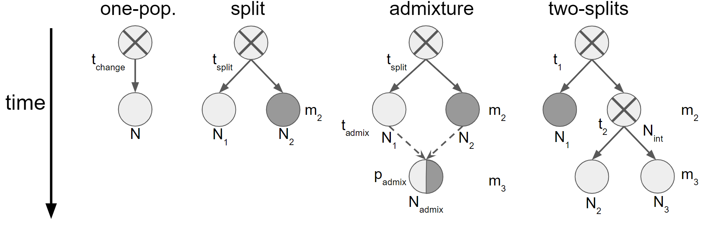

## This directory contains David Bass's contributions to the project. It is still in rough shape and needs additional documentation and organization.

### Pipeline outline
- `convert_GDS_to_VCF.R`: Convert raw data in GDS file to VCF file
- `get_average_n_eff_per_samp.py`: Parse metadata and VCF to calculate average effective sample size (`n_eff`) per sample
- For each region:
  - `construct_popinfos.R`: Parse metadata to construct popinfo file describing each region (e.g. Europe, Transatlantic, Americas, mainland)
  - `get_average_n_eff_per_popinfo.py`: Parse output of `get_average_n_eff_per_samp.py` per popinfo
  - `construct_sfs.py`: Parse VCF and popinfo to construct SFSs
  - `run_moments.py`: Given an SFS and model, run moments to fit the model to the SFS as data
  - For jackknifing:
    - `construct_jackknife_popinfos.py`: Jackknife popinfo file, i.e. create repeats in which one locality is removed from each population with >1 sample
    - `construct_jackknife_sfs.py`: Parse VCF and jackknifed popinfo to construct jackknifed SFSs
- `jupyter_nbs/jackknife_inference.ipynb`: Perform analysis and visualization of `moments` demographic inference runs on jackknife-replicate SFSs.
- `get_Fsts.py`: Model selections with $F_st$, the classical population genetic statistic for measuring population differentiation.

### Demographic inference on DEST2 data.

For split model, (est0, est1, est2, est3) is (N_EUW, N_EUE, T, m).

For admixture model, (est0, est1, est2, est3, est4, est5, est6, est7) is (N_1, N_2, N_admix, T_split, T_admix, m_2, m_3, p_admix), where N_1 describes the easternmost non-admixed population, N_2 describes the westernmost non-admixed population, m_2 is the migration rate in the 2-population epoch, and m_3 is the migration rate in the 3-population epoch.

To calculate collapsed log-likelihood, we sum 3D SFSs along their axis corresponding to SZ, “collapsing” them into a 2D SFS with the same shape as the SFSs used to fit the split model, then apply moments’ log-likelihood calculation function to collapsed data and model SFSs. The collapsed SFS effectively “integrates over” the alleles discovered in SZ, making it both geometrically and biologically comparable to the natively 2D SFSs yielded by the split model. This is a novel metric and is most appropriate for comparison of models with distinct numbers of populations.

The collpased likelihoods of all three admixture models far exceed the likelihood of the split model, indicating that 3-population models better describe 2-population models. It is worth noting that we have not searched the entire space of 2- and 3-population models, though doing so would likely be worthless because it is vast and composed of models that are biologically less intuitive than the admixture, split, and two_splits models that we have attempted to fit.

After rejecting the null hypothesis that a 2-population model is sufficient to describe European flies, we conclude that the admixture model in which SZ is the admixed population achieves the greatest likelihood. It is worth noting that collapsed likelihood favors the model in which EUW is the admixed population, though comparison via likelihoods, which are calculated on all available data, in the form of 3-dimensional SFSs, as opposed to down-projected, "collapsed" 2-dimensional SFSs.

Further analysis must investigate the potential of runaway behavior in certain parameter estimates, as it is implied to exist by migration rates of 0 and 10 (an upper bound provided to moments' optimization routine) in the EUW admixed and SZ admixed models, respectively.

We exclude two_splits models from this analysis because no convergence was observed in any of the three variants, indicating that, it is likely impossible to achieve a good fit to the data, and if a fit does exist, then it is likely rendered not biologically meaningful by extreme estimate values.

### Descriptions of each code file (in order of use)
`convert_GDS_to_VCF.R` is an R script that converts the GDS file encoding all variants discovered in the DEST v2.0 dataset into a gzip'ed VCF file.

`get_average_n_eff_per_samp.py` is a Python script that extracts from the VCF file the effective population size $n_eff$ from each pool-seq sample (as defined in [Feder et al. 2014](https://doi.org/10.1534/genetics.113.158220)). These values are collected in `get_average_n_eff_per_popinfo.py`, then used for the rounding of pool-seq allele frequency into allele counts during SFS construction in `construct_sfs.py`.

`get_average_n_eff_per_popinfo.py` is a Python script that takes in the output of `get_average_n_eff_per_samp.py`, stored in `metadata/mean_n_eff_per_sample_on_mainChroms.csv`, and the name (with extension) of a [popinfo](https://github.com/MomentsLD/moments/blob/main/moments/Misc.py#L576) file stored in `popinfos/` as a command-line argument, and outputs into `metadata/mean_n_eff_per_popinfo.csv`. The output values must then be copied into the dictionary `popinfo_metadata` at the top of `construct_sfs.py`. These values are average effective population sizes (across all samples to which a model is fit, as listed in a popinfo file that guides SFS construction) that are used in the rounding of pool-seq allele frequencies to integer counts.

`construct_popinfos.R` is an R script for writing lists of sample names from the metadata file `dest_v2.samps_8Jun2023.csv` into popinfo files that will instruct `moments` on where to put which samples during SFS construction in `construct_sfs.py`.

`construct_sfs.py` is a Python script that uses the VCF file, the popinfo files created with `construct_popinfos.py`, and $n_eff$ values calculated by `get_average_n_eff_per_popinfo.py` to construct the data site frequency spectra (SFSs) that will be input to moments. Running this script is not necessary, since it is partially redundant with generating jackknifed SFS replicates; in order to find initial parameter estimates for `moments` runs on jackknifed SFSs, we chose to first determine optimal parameter estimates on the "full" SFSs output by this script, in which no samples are jackknifed out.

`options/` is a directory containing Python scripts that generate the TSV "options" files used to guide wrapper scripts in this pipeline.

`wrapper_construct_sfs.slurm` is a Bash wrapper for running `construct_sfs.py` via Slurm on UVA HPC's Rivanna computer cluster. Using such a wrapper is recommended because of the enormous memory required for parsing the VCF file.

`construct_jackknife_popinfos.py` is a Python script that constructs jackknifed replicates of popinfo files output to the `popinfos/` directory by `construct_popinfos.py`. 

`construct_jackknife_sfs.py` is a Python script analogous to `construct_sfs.py`, but using jackknifed popinfo file replicates output by `construct_jackknife_popinfos.py`.

`wrapper_construct_jackknife_sfs.slurm` is a Bash wrapper for running `construct_jackknife_sfs.py` via Slurm on UVA HPC's Rivanna computer cluster. Using such a wrapper is recommended in order to generate many jackknifed replicates in parallel and to handle the enormous memory requirements of parsing the VCF file.

`moments_models.py` is a Python file containing functions that define the models used by `moments` for demographic inference. It is imported by `get_scaled_model_lls.py` and `run_moments.py`.

`run_moments.py` is a Python script that performs a single optimization run to fit a given `moments` model to a given SFS. Its many command-line arguments are handled by its wrapper script, `wrapper_run_moments.slurm`, and listed at the top of the `main()` function.

`wrapper_run_moments.slurm` is a Bash wrapper for running an array job of parallel demographic inference runs with `run_moments.py`, scheduled via Slurm on UVA HPC's Rivanna computer cluster.

`get_collected_output.py` is a Python script that merges `moments` output from demographic inference runs in different settings, stored in the directory `output/`. Its output is an unecessary intermediate TSV that we used to calculate initial parameter estimates to be input into `moments` runs on jackknifed SFSs.

`jupyter_nbs/jackknife_inference_analysis.ipynb` is a Jupyter notebook containing final analysis and visualization of the output from `run_moments.py` on jackknife-replicate SFSs produced by `construct_jackknife_sfs.py`.

`get_optimal_estimate_confidence_ints.py` is a Python script that uses output from `run_moments.py` found in `output/moments_output_jackknife.tsv` in order to calculate 95\% (median 38 of $n=40$ replicates performed in our experiment) confidence intervals for estimates of the parameters of the selected `moments` models.

`get_Fsts.py` is a python script that reads SFSs and uses `moments` to calculate their $F_st$ values, printing them to `stdout`, providing a classical validation of model selection decisions made via this pipeline.

`msprime_models.py` is a Python file containing functions that define the files used by `msprime` for demographic simulation. These models mirror the models in the `moments_models.py`, and they are used to perform simulation-based validation of collapsed-likelihood-based model selection procedure with `simulate_sfs.py` and `run_moments_on_simulated_sfss.py`. This simulation is reported in Text S3.

`simulate_sfs.py` is a Python script that uses `msprime`, together with demographic functions defined in `msprime_models.py`, to simulate replicates of American populations sampled in DEST v2.0 so that our collapsed-likelihood-based model selection procedure can be theoretically validated with `run_moments_on_simulated_sfss.py`. This simulation is reported in Text S3.

`wrapper_simulate_sfs.sh` is a Bash wrapper for running replicates of `msprime` population simulations via `simulate_sfs.py` whose initial parameters are to be reinferred for the simulation study in `run_moments_on_simulated_sfss.py`. It takes as a command-line argument the (number) index of the replicate. We ran this script in a command-line Bash `for` loop, iterating over indices to be input as the wrapper's command-line argument.

`run_moments_on_simulated_sfss.py` replicates the demographic inference performed on American populations in DEST v2.0, but on replicate data simulated with `msprime` in `simulate_sfs.py`. Its output is visualized and analyzed in `jupyter_nbs/CLL_validation.ipynb`.

`jupyter_nbs/CLL_validation.ipynb` visualizes and analyzes output from `run_moments_on_simulated_sfss.py` for Text S3.