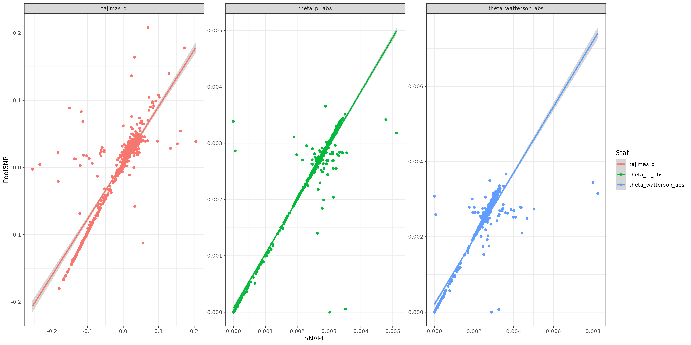
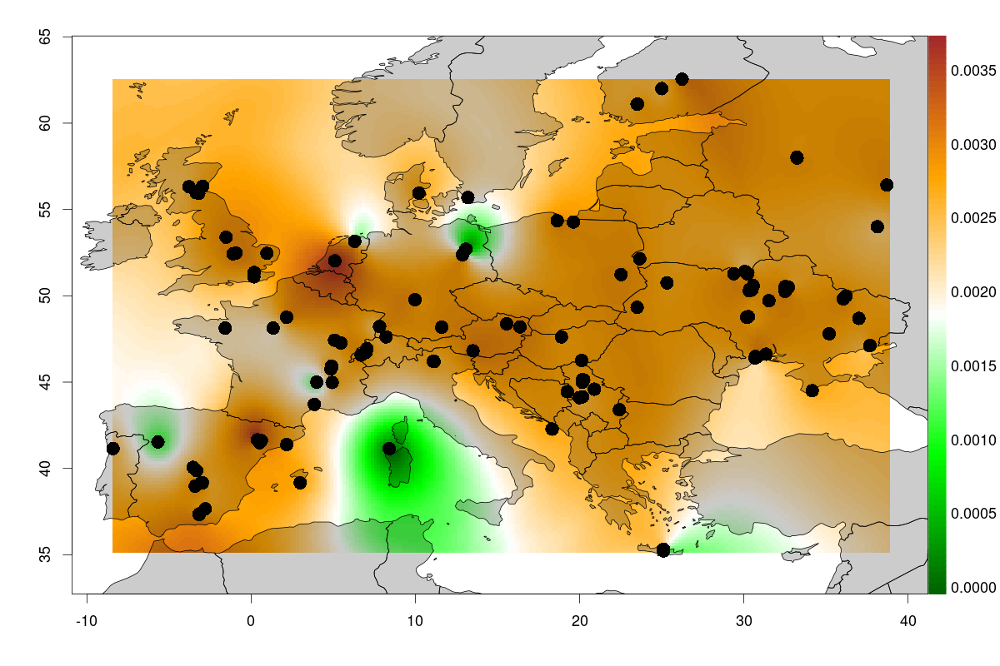
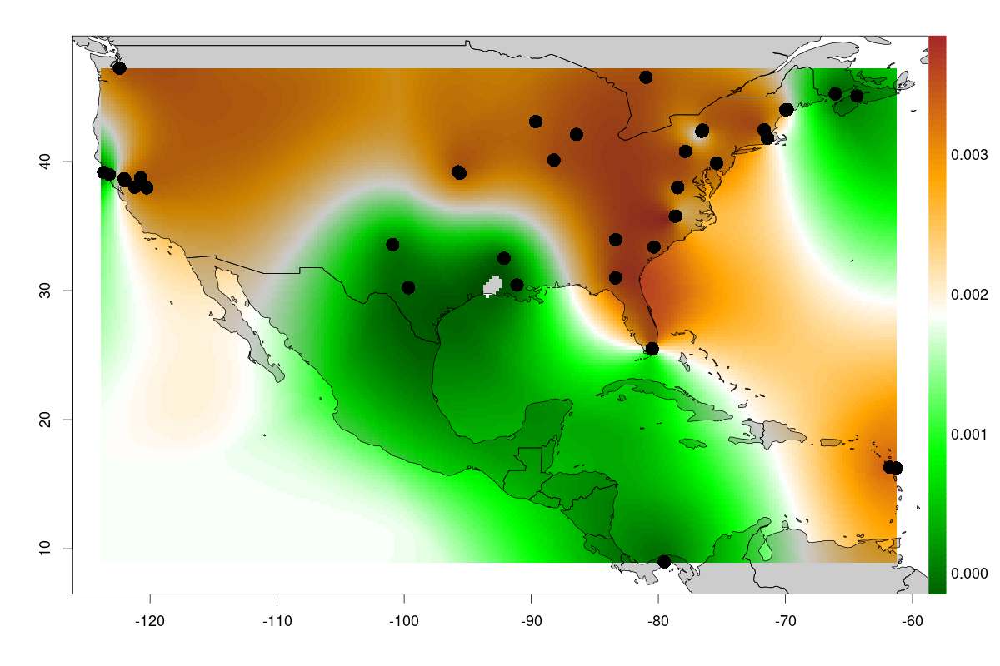
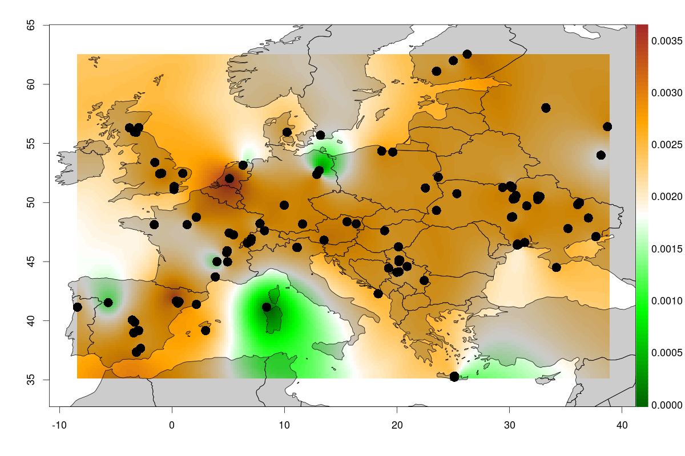
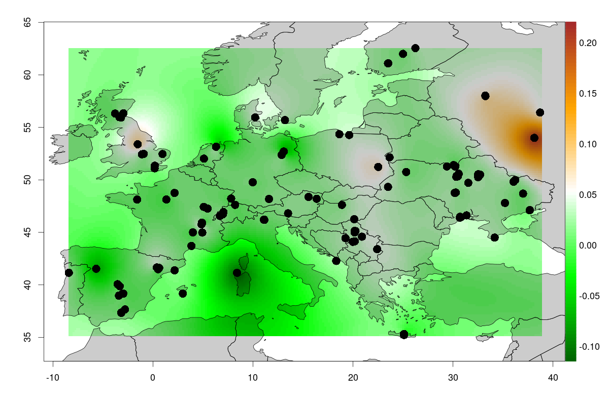
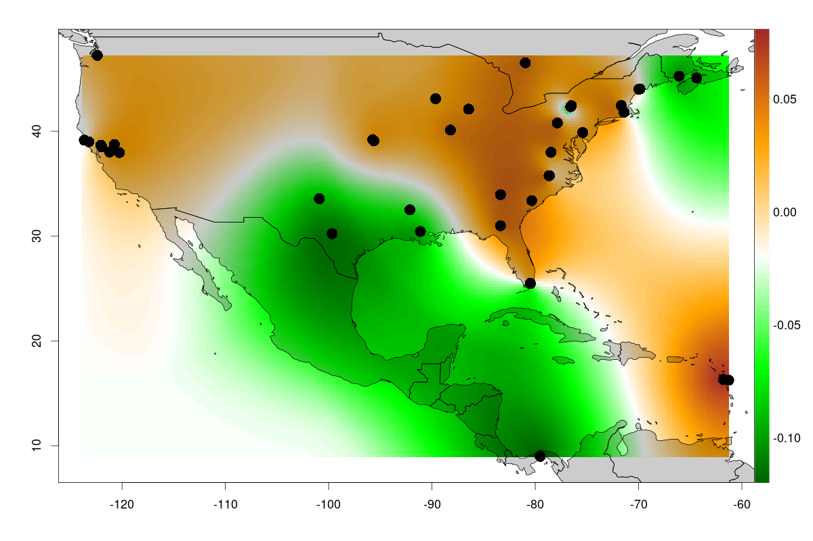

## Estimating Population Genetic parameters with [GreneDalf](https://github.com/lczech/grenedalf)

The full documentation of the analysis pipeline can be found [here](shell/main.sh)

Here, I am presenting the estimation of population genetics statistics ($\theta_{\pi}$, $\theta_W$ and Tajima's _D_) with [Grenedalf](https://github.com/lczech/grenedalf), which is a novel implementation of the PoPoolation(2) approach in C++. It is still quite buggy and unflexible, but it appears that the software is still under development. One of the advantages over the original PoPoolation approch is the flexibile input file formats. However, I did not manage to get the original VCF from our DEST2 dataset to work for mysterious reasons. Accordingly, I opened an issue concerning that problem. However, I was successful to use a SYNC file, which I generated from the original VCF file. 

Grenedalf complained about certain Populations with low Poolsizes, I subsequently excluded these from the analyses.

Moreover, I had to replace the missing data fields `.:.:.:.:.:.` in the SYNC files with `0:0:0:0:0:0`.

I obtained chromosome-wise estimates and the took the average weighted by the chromosome-length to calculate genome-wide estimates.

These can be found below and in the following TSV files for [PoolSNP](results/Grenedalf_poolsnp.summary) and [SNAPE](results/Grenedalf_snape.summary);

Below, I am further showing the correlation between the estimates of SNAPE and PoolSNP.

## Is there any geographic structure?

Below, I show a few maps where I interpolated population genetic parameters acording to geographic distribution of the samples

### $\theta_{\pi}$ based on PoolSNP in Europe and North America 

### $\theta_{Watterson}$ based on PoolSNP in Europe and North America 

### Tajima's _D_ based on PoolSNP in Europe and North America 

