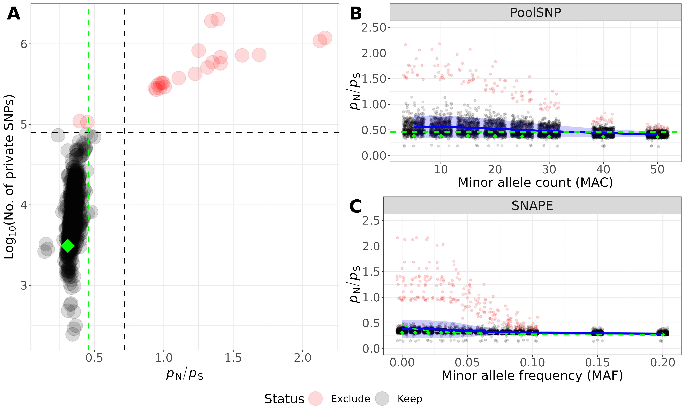

## _P_n_P_s analysis

Following the approach in our DESTv.1 paper, I now calculated _P_n_P_s ratios for the SNAPE dataset and counted the number of private SNPs. Based on a threshold for _P_n_P_s and privates SNPs (i.e., mean(stat)*SD(Stat)*1.96), I categorized populations with basedcalling based on SNAPE as "Keep" and "Exclude". The corresponding table can be found [here](results/classify_pops.txt). Let's discuss what to do with the two samples with log10(priv.SNPS)~5 :wink:

I further plotted the _P_n_P_s ratios for various MAF thresholds (at the sample level) for the SNAPE dataset and various MAC thresholds (across all samples pooled) for the PoolSNP dataset as in the DESTv.1 dataset and compared these to the Raleigh (DPGP) dataset (highlighted as a green line), which serves as our null-expectation, given that the _P_n_P_s ratios are based on single individual sequencing data. These data are thus supposedly not (strongly) confounded by false positive/negative SNPs. The figure below thus corresponds to Figure 2 in the DESTv.1 paper

