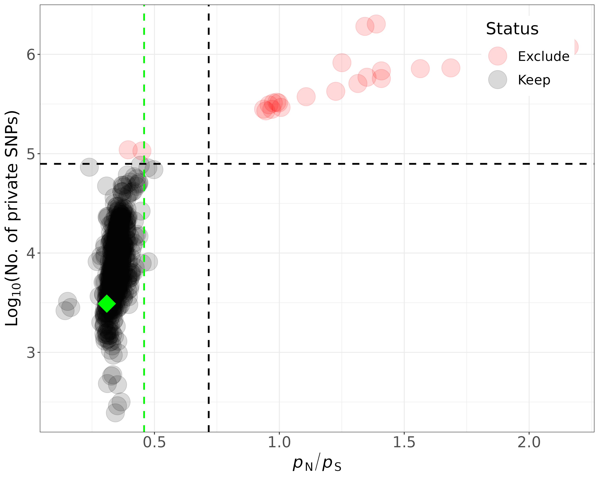

## _P_n_P_s analysis

Following the approach in our DESTv.1 paper, I now calculated _P_n_P_s ratios for the SNAPE dataset and counted the number of private SNPs. Based on a threshold for _P_n_P_s and privates SNPs (i.e., mean(stat)*SD(Stat)*1.96), I categorized populations with basedcalling based on SNAPE as "Keep" and "Exclude". The corresponding table can be found [here](results/classify_pops.txt) and the corresponding figure is below.

To carry out the corresponding analysis with PoolSNP, I would need VCF datasets based on various MAC and MAF thresholds

